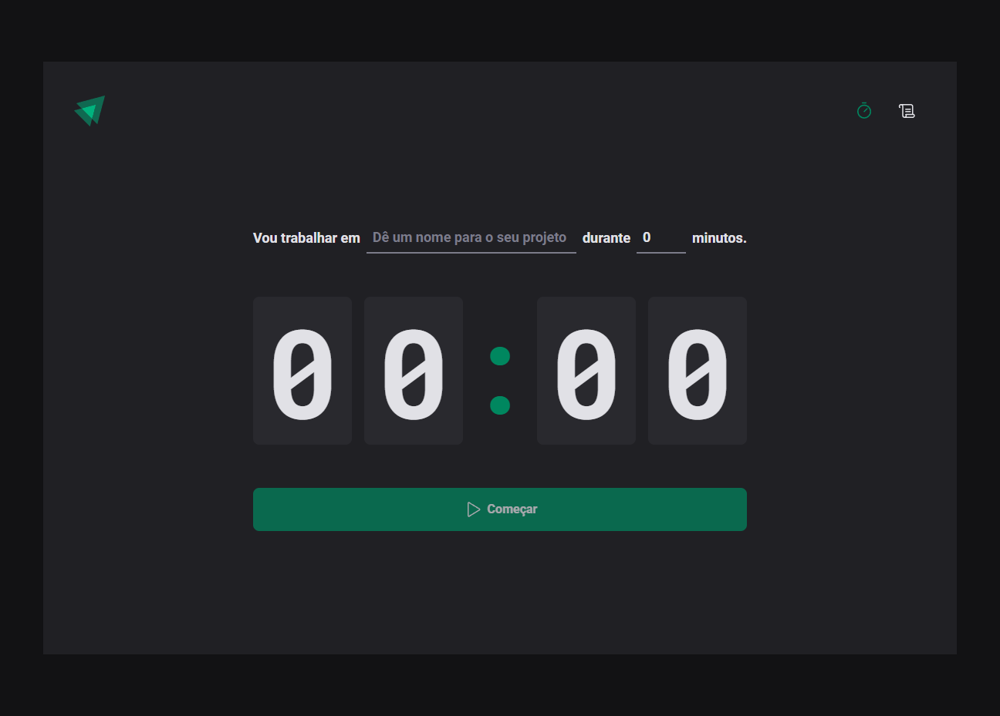
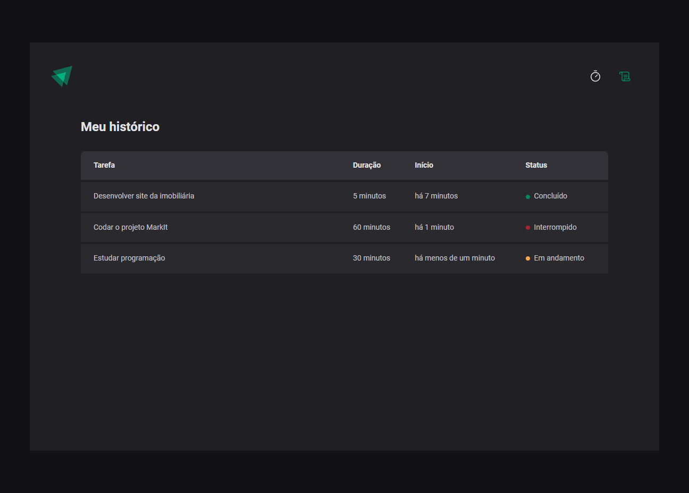

# Pomodoro Timer

## Application created to set the time for a task and track its progress through history

> The project aimed to improve knowledge about Context API, Reducers, React hooks, React Hook Form with Zod, React Router DOM, using React+Vite, Styled Components and TypeScript to build it.

🔗 [Click here to access](https://matheusborgesdev.github.io/pomodoro-timer)

## 💻 Technologies

- React+Vite
- Typescript
- Styled components
- Figma

## 📧 Contact

matheusb.dev@gmail.com
